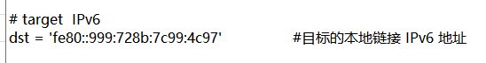
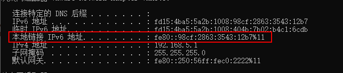

# CVE-2020-16898
PoC BSOD for CVE-2020-16898 (badneighbor)

Tested against Windows 10 version 2004

条件：能和目标通信，知道目标的本地链接IPv6地址

使用

```
修改代码中的dst参数为目标的本地链接IPv6地址
然后攻击机执行
python3 CVE-2020-16898.py即可
```



